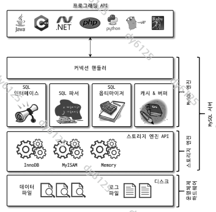
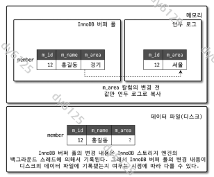
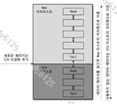
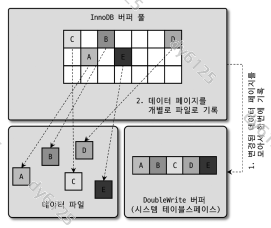
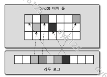
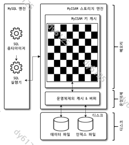

# Real MySQL 8.0 4장 아키텍처

> Real MySQL 8.0 스터디 / jintae(swcide)
>
> 책의 주요 절 순서를 따라 핵심 원리·조건·대표 예제를 정리.
> MySQL 8.0 기준이며, 세부 버전에 따른 차이는 해당 항목에 표시.

## 4.1 MySQL 엔진 아키텍처

### 4.1.1 MySQL의 전체 구조

- **MySQL 엔진**: 연결 관리, SQL 해석, 실행 계획 수립과 실행 흐름 제어.
- **스토리지 엔진**: 실제 데이터 접근과 저장.
  - 대표 엔진: InnoDB, MyISAM, MEMORY.
  - 같은 서버에서도 테이블마다 다른 엔진 지정 가능.
  - 엔진에 따라 트랜잭션, 잠금, 캐시, 복구 방식에 차이.



- **핸들러 API**: 두 계층 사이의 공통 인터페이스.
  - 실행 엔진이 레코드 읽기·변경 등을 요청하는 통로.
  - 한 SQL에서 많은 레코드를 읽으면 여러 번의 핸들러 호출 발생.

```sql
SHOW GLOBAL STATUS LIKE 'Handler%';
```

- 이 상태 값은 내부 접근 패턴을 확인하는 단서.
  - 글로벌 누적 값이므로 특정 쿼리 분석 시 관찰 구간과 다른 작업의 영향 고려.

### 4.1.2 MySQL 스레딩 구조

- **포그라운드 스레드**: 클라이언트의 쿼리 실행과 결과 전달.
  - 전통적인 모델에서는 연결의 요청을 담당할 스레드 할당.
  - 필요한 데이터가 캐시에 없으면 디스크 읽기도 수행.
  - 연결 종료 후 스레드 캐시에 보관해 재사용 가능.
  - 관련 설정: `thread_cache_size`.

- **백그라운드 스레드**: 더티 페이지 플러시, 리두 로그 기록, 체인지 버퍼 병합, 퍼지 등.
  - 사용자 쿼리 처리와 내부 유지 작업을 나누어 실행.
  - 복구용 로그를 확보한 상태에서 데이터 파일 쓰기를 지연·병합 가능.

- **쓰기 지연에도 한계가 있음.**
  - 더티 페이지나 로그 공간이 부족하면 바쁜 중에도 플러시 필요.
  - 쓰기가 변경 발생 속도를 따라가지 못하면 사용자 쿼리도 영향받음.

### 4.1.3 메모리 할당 및 사용 구조

| 구분 | 사용 범위 | 대표 공간 |
| --- | --- | --- |
| 글로벌 메모리 | 여러 스레드가 공유 | 버퍼 풀, 로그 버퍼, 테이블 캐시 |
| 로컬 메모리 | 연결·쿼리별 사용 | 정렬 버퍼, 조인 버퍼, 네트워크 버퍼 |

- **글로벌 메모리**는 연결마다 전체 공간이 새로 생기지 않음.
- **로컬 메모리**는 동시 작업 수에 따라 사용량이 증가할 수 있음.
  - 모든 버퍼를 접속 즉시 최대 크기로 할당하는 것은 아님.
  - 정렬·조인 시 할당되는 공간과 연결 동안 유지되는 공간이 공존.

- **메모리 설정의 기준**: 버퍼 풀만이 아니라 전체 사용량.
  - 버퍼 풀을 과도하게 키우면 연결별 작업 공간과 운영체제의 여유 부족.
  - 평소에는 괜찮아도 동시 실행 급증 시 메모리 부족 가능.

### 4.1.4 플러그인 스토리지 엔진 모델

- **플러그인**: 정해진 인터페이스를 구현한 기능을 서버에 추가하는 방식.
  - 스토리지 엔진 외에도 인증, 전문 검색 파서, 쿼리 재작성 등에 사용.
  - `SHOW ENGINES`: 스토리지 엔진의 지원 상태.
  - `SHOW PLUGINS`: 설치된 플러그인과 상태.

- 스토리지 엔진을 교체해도 SQL 계층은 공통으로 사용.
  - 실행 계획과 전체 흐름은 MySQL 엔진이 담당.
  - 실제 레코드 접근은 핸들러를 통해 각 스토리지 엔진에 요청.

### 4.1.5 컴포넌트

- **컴포넌트**: MySQL 8.0에서 플러그인 구조의 제약을 개선한 확장 방식.
  - 기존 제약: 서버 내부 의존, 기능 간 통신과 의존 관계 관리의 어려움.
  - 개선: 다른 컴포넌트의 서비스 이용과 의존 관계 표현.

- 대표 예: 비밀번호 검증용 `component_validate_password`.
  - 플러그인과 컴포넌트는 설치·관리 명령이 다르므로 구분 필요.

### 4.1.6 쿼리 실행 구조

| 단계 | 역할 | 확인할 문제 |
| --- | --- | --- |
| 쿼리 파서 | 토큰 분리와 파서 트리 생성 | SQL 문법 |
| 전처리기 | 객체·권한 검사 | 테이블·컬럼 존재, 접근 권한 |
| 옵티마이저 | 비용을 추정해 실행 계획 선택 | 인덱스, 조인 순서, 정렬·집계 |
| 실행 엔진 | 계획을 개별 작업으로 연결 | 읽기·가공·결과 전달 흐름 |
| 핸들러 | 스토리지 엔진의 실제 데이터 접근 | 저장 구조와 접근 비용 |

- **옵티마이저의 비용은 추정값.**
  - 통계와 데이터 분포에 따라 예상과 실제 성능이 달라질 수 있음.
  - 실행 계획을 확인하는 이유는 선택된 접근 방법과 실제 비용을 비교하기 위함.

- 임시 테이블로 집계하는 계획의 예:
  1. 임시 테이블 준비.
  2. 조건에 맞는 레코드 읽기.
  3. 임시 테이블에 저장·집계.
  4. 결과 읽기와 전달.

- 모든 `GROUP BY`가 임시 테이블을 사용하는 것은 아님.
  - 선택된 계획을 실행 엔진이 어떻게 작업으로 연결하는지 보여주는 예제.

### 4.1.7 복제

- **복제**: 서버의 변경 내용을 다른 서버로 전달하는 기능.
  - 상세 동작은 책의 16장에서 다룸.

- 로그의 목적도 구분 필요.
  - **리두 로그**: InnoDB 장애 복구.
  - **바이너리 로그**: 복제와 시점 복구 등.

### 4.1.8 쿼리 캐시

- **쿼리 캐시**: 동일 SQL의 결과를 재사용하던 기능.
  - 원본 데이터가 바뀌면 관련 결과의 무효화 필요.
  - 변경과 동시 실행이 많으면 관리 비용이 병목 가능.
  - MySQL 8.0에서 제거.

- **버퍼 풀과는 다른 캐시.**
  - 쿼리 캐시: 완성된 SQL 결과.
  - 버퍼 풀: 데이터·인덱스 페이지.
  - 쿼리 캐시 제거가 데이터 캐시 제거를 의미하지는 않음.

### 4.1.9 스레드 풀

- **목적**: 여러 연결의 작업을 제한된 실행 스레드에 배분.
  - 스레드 증가에 따른 스케줄링·컨텍스트 스위칭 비용 완화.
  - 연결 종료 후 재사용을 위한 스레드 캐시와 구분.

- **작업이 지연될 때의 균형**
  - 스레드를 지나치게 추가하면 제한 효과 감소.
  - 새 요청을 너무 오래 기다리게 하면 응답 시간 증가.
  - 효과는 연결 수뿐 아니라 CPU 사용, 작업 시간, 잠금 대기에 따라 달라짐.

- 책은 Percona Server의 구현도 설명.
  - `thread_pool_size`, `thread_pool_stall_limit` 등을 MySQL 커뮤니티 서버의 공통 설정으로 오해하지 않기.

### 4.1.10 트랜잭션 지원 메타데이터

- **메타데이터**: 테이블 구조와 스토어드 프로그램 정의 등 객체를 설명하는 정보.
  - 데이터 파일이 있어도 구조 정보가 어긋나면 정상 사용이 어려움.

- **MySQL 5.7까지**: FRM 등 파일 기반 관리.
  - DDL 중 장애가 나면 메타데이터 변경의 중간 상태가 남을 수 있었음.

- **MySQL 8.0**: InnoDB 기반 데이터 딕셔너리와 시스템 테이블.
  - 지원되는 DDL·메타데이터 변경의 일관된 완료와 복구를 위한 기반.
  - 내부 딕셔너리는 직접 접근을 제한하고 `information_schema` 등으로 정보 제공.

- **행 데이터뿐 아니라 테이블 정의도 일관성 보장의 대상.**

---

## 4.2 InnoDB 스토리지 엔진 아키텍처

### 4.2.1 프라이머리 키에 의한 클러스터링

- **클러스터 인덱스**: 키와 행 데이터를 함께 저장하는 구조.
  - 명시적인 PK가 있으면 클러스터 키로 사용.
  - PK가 없으면 적절한 `UNIQUE NOT NULL` 인덱스 또는 내부 식별자 사용.

- **세컨더리 인덱스**에는 행의 물리 주소 대신 PK 저장.
  - 인덱스에 없는 컬럼이 필요하면 PK로 클러스터 인덱스를 다시 탐색.
  - 필요한 컬럼이 모두 있는 커버링 조회는 추가 접근을 줄일 수 있음.

```text
세컨더리 인덱스에서 조건 검색
    -> PK 획득
    -> 필요한 경우 클러스터 인덱스에서 행 조회
```

- **PK 선택의 영향**
  - 긴 PK는 여러 세컨더리 인덱스의 크기도 함께 증가시킴.
  - 저장 공간과 캐시 효율까지 연결되는 설계 요소.

- 키 순서로 조직됐다는 것과 디스크의 모든 행이 연속 배치됐다는 것은 구분 필요.
  - 페이지 분할과 공간 재사용도 발생.
  - 참고: [클러스터·세컨더리 인덱스](https://dev.mysql.com/doc/refman/8.0/en/innodb-index-types.html)

### 4.2.2 외래 키 지원

- **외래 키**: 부모·자식 테이블의 참조 관계 검사.
  - 존재하지 않는 부모 참조와 제약에 어긋나는 부모 삭제 등을 방지.

- **검사 비용과 잠금**
  - 관련 인덱스로 참조 대상의 존재 확인.
  - 한 테이블의 변경이 부모·자식 테이블의 잠금에도 영향 가능.
  - 복잡한 관계에서는 접근 순서와 데드락 가능성 검토 필요.

- `foreign_key_checks`로 검사를 일시적으로 중지할 수 있지만 일관성 보장을 대신하지는 않음.
  - 다시 켜도 중지한 동안의 데이터를 전부 재검사·복구하지 않음.
  - 연쇄 삭제가 실행됐을 것이라고 가정하지 않기.
  - 사용 시 세션 범위와 작업 후 관계 검증·설정 복원 필요.

### 4.2.3 MVCC

- **MVCC**: 한 레코드의 여러 버전을 활용하는 동시성 제어 방식.
  - 현재 페이지에는 변경된 값 보관.
  - 언두 로그에는 이전 상태를 재구성할 정보 보관.
  - 읽는 트랜잭션의 격리 수준과 스냅샷에 맞는 버전 제공.



#### 두 세션으로 보는 변경과 조회

- 실습용 데이터베이스에서 회원의 지역을 `서울`에서 `경기`로 변경하는 예제.

```sql
CREATE TABLE member (
    m_id INT PRIMARY KEY,
    m_area VARCHAR(100) NOT NULL
) ENGINE = InnoDB;

INSERT INTO member VALUES (12, '서울');
COMMIT;
```

- **세션 A**: 변경한 뒤 아직 커밋하지 않은 상태 유지.

```sql
START TRANSACTION;
UPDATE member SET m_area = '경기' WHERE m_id = 12;
```

- **세션 B**: `READ COMMITTED`에서 일반 조회.

```sql
SET SESSION TRANSACTION ISOLATION LEVEL READ COMMITTED;
START TRANSACTION;
SELECT m_area FROM member WHERE m_id = 12;
-- 결과: 서울
```

- B는 A의 행 잠금이 풀릴 때까지 기다리지 않고 커밋된 이전 버전 조회.
  - A가 `COMMIT`한 뒤 B가 다시 조회하면 새 스냅샷에서 `경기` 확인 가능.
  - 실습 종료 시 B도 `COMMIT` 또는 `ROLLBACK`으로 정리.

| 읽기 방식 | 스냅샷 기준 |
| --- | --- |
| `READ COMMITTED`의 일관된 읽기 | 각 읽기에서 새 스냅샷 |
| `REPEATABLE READ`의 일관된 읽기 | 같은 트랜잭션의 첫 일관된 읽기에서 정한 스냅샷 |

- 커밋했다고 언두가 곧바로 모두 삭제되는 것은 아님.
  - 오래된 스냅샷을 위해 이전 버전이 계속 필요할 수 있기 때문.
  - 참고: [일관된 읽기](https://dev.mysql.com/doc/refman/8.0/en/innodb-consistent-read.html)

### 4.2.4 잠금 없는 일관된 읽기

- **적용 범위**: `READ COMMITTED`·`REPEATABLE READ`의 일반 `SELECT`.
  - 다른 트랜잭션이 변경 중인 행의 잠금을 기다리지 않고 보이는 버전 조회.

- **모든 읽기·쓰기가 서로 영향을 주지 않는다는 뜻은 아님.**
  - `SELECT ... FOR UPDATE`, `SELECT ... FOR SHARE`: 잠금을 사용하는 읽기.
  - `UPDATE`, `DELETE`: 잠금과 경합 발생 가능.
  - 테이블 정의를 보호하는 메타데이터 잠금도 별도로 존재.

- **오래 열린 읽기 트랜잭션도 비용 발생.**
  - 언두 정리를 지연시켜 공간과 이전 버전 탐색 비용 증가 가능.
  - 작업이 끝난 연결을 커밋·롤백 없이 방치하지 않기.

### 4.2.5 자동 데드락 감지

- **데드락**: 서로의 잠금을 기다려 진행하지 못하는 순환 대기.
  - A: 1번 행 보유 → 2번 행 요청.
  - B: 2번 행 보유 → 1번 행 요청.

- InnoDB는 대기 관계를 검사하고 트랜잭션을 롤백해 해소.
  - 일반적으로 변경량이 작은 트랜잭션을 선택하려고 함.
  - 롤백 비용과 전체 영향을 줄이기 위함.

```sql
SHOW ENGINE INNODB STATUS;
```

- `LATEST DETECTED DEADLOCK`에서 SQL별 보유·대기 잠금 확인.
  - 접근 순서를 맞추거나 트랜잭션을 짧게 만드는 개선으로 연결.

- **감지에도 비용이 있음.**
  - 높은 동시성에서 대기 관계 검사 자체가 부담 가능.
  - 감지를 끄고 타임아웃에 의존하면 해소까지의 대기가 길어질 수 있음.
  - 애플리케이션의 오류 처리·트랜잭션 정리·재시도도 필요.

### 4.2.6 자동화된 장애 복구

- 비정상 종료 시 데이터 파일에는 서로 다른 상태가 남을 수 있음.
  - 커밋했지만 아직 페이지에 덜 반영된 변경.
  - 커밋하지 않았지만 페이지에 먼저 기록된 변경.

- **재시작 복구**
  - 리두 로그로 필요한 변경 재현.
  - 언두로 미완료 트랜잭션의 변경 취소.

- **강제 복구 모드**: `innodb_force_recovery`.
  - 정상 복구 일부를 생략해 데이터를 추출할 기회를 확보하는 수단.
  - 값이 클수록 더 많은 절차를 생략하므로 기동 성공이 정상 복구를 뜻하지 않음.
  - 백업·원본 복사본 확보 후 필요한 최소 단계로 접근.
  - 단계가 높아질수록 백그라운드 처리, 트랜잭션 롤백, 버퍼 병합, 언두 검사, 리두 적용 등을 생략.
  - 손상된 원본을 보존하고 읽을 수 있는 데이터를 추출해 새 인스턴스를 구성하는 것이 목적.

### 4.2.7 InnoDB 버퍼 풀

#### 캐시와 쓰기 버퍼

- **캐시**: 디스크에서 읽은 데이터·인덱스 페이지를 메모리에 보관.
- **쓰기 버퍼**: 변경된 페이지를 모아 데이터 파일에 기록.

- `innodb_buffer_pool_size`로 크기 설정.
  - 연결별 작업 공간, 운영체제와 다른 프로세스의 메모리도 확보 필요.
  - 동적 변경이 가능해도 축소 시 페이지 재배치·플러시 부하에 주의.

#### 페이지 관리 구조

| 목록 | 관리 목적 |
| --- | --- |
| LRU 리스트 | 사용 이력에 따른 페이지 유지·교체 |
| 플러시 리스트 | 더티 페이지 기록과 체크포인트 진행 |
| 프리 리스트 | 새 페이지를 적재할 빈 공간 관리 |

- 같은 더티 페이지가 LRU와 플러시 관리의 대상일 수 있음.
  - 목록마다 완전히 다른 데이터를 저장하는 구조는 아님.



- **New/Old 구분**: 일회성 대량 스캔의 캐시 오염 완화.
  - 새 페이지는 Old에 배치.
  - 실제 접근과 시간 조건 등에 따라 New로 승격.
  - 오래 사용되지 않은 페이지는 교체 대상.

#### 리두 로그와 플러시

- **더티 페이지**: 변경돼 데이터 파일과 내용이 달라진 페이지.
- **리두 로그 공간**은 제한돼 있으므로 오래된 부분의 재사용 필요.
  - 해당 변경이 데이터 파일에 반영돼야 복구용 로그를 재사용할 수 있음.
  - 더티 페이지 플러시와 체크포인트가 이 관계를 연결.

- **버퍼 풀만 늘려도 쓰기 버퍼링이 충분히 개선되지 않을 수 있음.**
  - 로그 공간이 작으면 플러시를 서둘러야 함.
  - 반대로 로그가 커도 버퍼 풀이 작으면 페이지를 담을 공간이 먼저 부족.

- **플러시의 균형**
  - 너무 적게 기록: 변경 누적 후 순간적인 쓰기 급증 가능.
  - 너무 적극적으로 기록: 같은 페이지의 변경을 모을 기회 감소.
  - 어댑티브 플러시는 리두 생성 속도와 현재 상태 등을 반영.

#### 재시작 후 워밍업

- 재시작하면 메모리 캐시가 사라져 초기 디스크 읽기 증가.
- 버퍼 풀 상태를 저장해 두면 자주 쓰던 페이지를 다시 적재하는 데 활용 가능.

```sql
SET GLOBAL innodb_buffer_pool_dump_now = ON;
SET GLOBAL innodb_buffer_pool_load_now = ON;
SHOW STATUS LIKE 'Innodb_buffer_pool_load_status';
```

- 덤프는 페이지 식별 정보를 저장하며 실제 데이터 백업을 대체하지 않음.
  - 적재는 데이터 파일을 다시 읽는 작업이므로 I/O 비용 발생.
  - 캐시의 전체 사용량뿐 아니라 실제로 자주 쓰는 데이터가 올라왔는지도 확인 필요.

### 4.2.8 Double Write Buffer

- **부분 쓰기 문제**: 페이지를 기록하다 장애가 나서 일부만 반영되는 상황.
  - 페이지 앞뒤가 서로 다른 상태가 되는 torn page 가능.
  - 리두 로그는 변경 내용을 기록하므로 바탕 페이지가 손상되면 로그만으로 복구하기 어려울 수 있음.

- **더블 라이트**: 데이터 파일의 제자리에 쓰기 전에 온전한 페이지 사본 기록.
  1. 변경 페이지들을 별도 영역에 모아 기록.
  2. 각 데이터 파일 위치에 반영.
  3. 장애 후 불완전한 페이지를 발견하면 사본으로 복구 지원.



- **리두 로그와 역할이 다름.**
  - 더블 라이트: 불완전한 페이지 쓰기에 대비.
  - 리두 로그: 필요한 변경을 다시 적용.

- **버전 차이**: MySQL 8.0.20부터 별도의 더블 라이트 파일 사용.
  - 책의 시스템 테이블스페이스 설명과 저장 위치 구분 필요.
  - 참고: [더블 라이트 공식 문서](https://dev.mysql.com/doc/refman/8.0/en/innodb-doublewrite-buffer.html)

### 4.2.9 언두 로그

- **언두 로그**: 변경 전 상태를 복원할 정보.
  - 롤백 시 변경 취소.
  - MVCC의 일관된 읽기에 필요한 과거 버전 구성.

- **언두의 수명은 변경한 트랜잭션 하나만으로 결정되지 않음.**
  - B가 변경 후 커밋해도, 더 오래된 A의 스냅샷을 위해 관련 언두가 필요할 수 있음.
  - 장시간 트랜잭션은 언두 정리를 지연시켜 공간과 탐색 비용에 영향.

#### 모니터링과 공간 관리

```sql
SHOW ENGINE INNODB STATUS;

SELECT count
FROM information_schema.innodb_metrics
WHERE subsystem = 'transaction'
  AND name = 'trx_rseg_history_len';
```

- **`History list length`**: 퍼지를 기다리는 이력 규모를 관찰하는 지표.
  - 변경된 행 수나 언두 파일 바이트 크기와 동일한 단위는 아님.
  - 평소 대비 증가 추세, 트랜잭션 종료 후 감소 여부를 함께 확인.

- **언두 테이블스페이스**: 언두 로그가 저장되는 공간.
  - 내부적으로 롤백 세그먼트와 슬롯을 사용.
  - MySQL 8.0에서는 별도 공간의 관리와 불필요한 공간 반환 지원.
  - 아직 필요한 이력은 공간 정리를 위해 임의로 제거할 수 없음.
  - 비활성화 후에도 기존 사용 종료와 퍼지를 기다려야 하며 파일을 직접 삭제하지 않기.
  - 비워진 공간은 다시 활성화하거나 해당 테이블스페이스 삭제 명령으로 정리.

### 4.2.10 체인지 버퍼

- 행 변경 시 관련 세컨더리 인덱스도 수정 필요.
  - 대상 페이지가 버퍼 풀에 없으면 작은 변경에도 디스크 읽기 발생.
  - 서로 다른 페이지의 변경이 많을수록 랜덤 I/O 비용 증가.

- **체인지 버퍼**: 조건에 맞는 인덱스 변경을 임시 보관하고 나중에 병합.
  - 여러 변경을 모아 페이지 읽기·쓰기 횟수를 줄일 여지 확보.
  - 유니크 인덱스는 중복을 먼저 검사해야 하므로 같은 방식으로 지연할 수 없음.
  - 대상 페이지가 이미 버퍼 풀에 있으면 바로 반영 가능.

- **설정과 비용**
  - `innodb_change_buffering`: 버퍼링할 작업 종류 선택.
  - `innodb_change_buffer_max_size`: 버퍼 풀 내 사용 비율 제한.
  - 메모리를 더 쓰는 만큼 일반 데이터 캐시에 사용할 공간은 감소 가능.
  - 미룬 변경은 이후 병합 비용으로 남음.

### 4.2.11 리두 로그 및 로그 버퍼

- **리두 로그**: 데이터 파일에 덜 반영된 변경을 장애 후 재적용하기 위한 기록.
  - 데이터 파일의 랜덤 쓰기를 매번 즉시 수행하지 않아도 복구할 기반 제공.

- **WAL(Write-Ahead Logging)**
  - 변경된 페이지를 디스크에 반영하기 전에 복구용 로그가 먼저 영속화돼야 함.
  - 장애 후 필요한 변경을 로그로 재현 가능.

| 공간 | 보관하는 내용 |
| --- | --- |
| 버퍼 풀 | 데이터·인덱스 페이지 |
| 로그 버퍼 | 메모리의 리두 로그 내용 |
| 리두 로그 파일 | 디스크에 기록한 변경 로그 |

#### 커밋과 로그 동기화

- **`innodb_flush_log_at_trx_commit`**: 커밋 시 기록·동기화 수준 제어.
  - 운영체제 파일 캐시까지 기록하는 작업과 저장 장치까지 동기화하는 작업을 구분.

| 값 | 동작 | 장애 시 고려 사항 |
| --- | --- | --- |
| `1` | 커밋 시 기록·동기화 | 저장 장치가 동기화 요청을 올바르게 이행한다는 전제에서 커밋 내용 보존 |
| `2` | 커밋 시 OS에 기록, 디스크 동기화는 주기적으로 수행 | OS·전원 장애에서는 최근 변경 손실 가능 |
| `0` | 기록·동기화를 주기적으로 수행 | MySQL 프로세스 장애에서도 최근 변경 손실 가능 |

- 책의 기본 설명은 주기적인 기록·동기화가 1초 간격으로 수행되는 것.
  - 스케줄링 등의 영향으로 정확한 주기를 보장하지 않음.
  - 손실 가능 시간의 엄밀한 상한으로 해석하지 않기.

#### 버퍼 풀과 로그 용량의 관계



- **LSN**: 로그 진행 위치를 나타내는 증가 번호.
- **체크포인트 에이지**: 현재 LSN과 최근 체크포인트 LSN의 차이.
  - 아직 복구에 필요한 로그 범위를 이해하는 기준.
  - 오래된 변경 페이지의 플러시가 체크포인트 진행과 공간 재사용으로 연결.

- **로그가 너무 작으면** 오래된 공간을 빨리 재사용하기 위해 플러시를 서둘러야 함.
- **로그가 커도** 버퍼 풀이 작으면 더티 페이지를 담을 공간이 먼저 부족.
  - 버퍼 풀·로그 용량과 실제 변경·플러시 속도를 함께 고려.

- **버전 차이**
  - 책의 계산: `innodb_log_file_size * innodb_log_files_in_group`.
  - MySQL 8.0.30부터: `innodb_redo_log_capacity`로 용량 제어.
  - 참고: [리두 로그 설정](https://dev.mysql.com/doc/refman/8.0/en/innodb-init-startup-configuration.html)

#### 아카이빙과 비활성화

- **리두 로그 아카이빙**: 온라인 물리 백업이 필요한 로그를 놓치지 않도록 별도 파일에도 기록.
  - 데이터 파일 복사 중 발생한 변경까지 확보해야 백업의 일관성을 맞출 수 있음.
  - 시작 세션 유지와 정상적인 종료 절차 필요.
  - 데이터 파일 백업 없이 리두 로그만으로 전체 복원하는 기능은 아님.

- **리두 로그 비활성화**: 새 인스턴스의 대량 적재 같은 특수 작업용.
  - 장애 시 페이지별 상태가 어긋나 인스턴스 재구성이 필요할 수 있음.
  - 운영 중인 서버의 일반적인 성능 조정 항목으로 사용하지 않기.
  - 커밋 동기화 시점 조정과 로그 생성을 없애는 것은 영향 범위가 다름.

### 4.2.12 어댑티브 해시 인덱스

- **목적**: 자주 찾는 키에 대한 반복 B-Tree 탐색 비용 감소.
  - 사용자가 생성하는 인덱스와 달리 InnoDB가 접근 패턴에 따라 내부 관리.
  - 버퍼 풀에 있는 데이터의 접근 경로를 빠르게 찾는 기능.
  - 페이지가 버퍼 풀에서 제거되면 관련 해시 정보도 유지 불가.

- **효과를 기대할 수 있는 경우**
  - 메모리에 있는 일부 데이터를 반복 조회.
  - 동등 비교와 `IN` 조건의 빈도가 높고 탐색 CPU 비용이 큰 상황.

- **비용도 함께 확인**
  - 메모리 사용, 항목 생성·삭제, 내부 동기화 필요.
  - 디스크 읽기가 많은 작업에서는 이득이 작을 수 있음.
  - 해시 검색 비율만이 아니라 CPU, 처리량, 메모리 사용량을 함께 비교.
  - 테이블 삭제·변경 시 관련 정보 정리 비용도 고려.

### 4.2.13 InnoDB와 MyISAM, MEMORY 스토리지 엔진 비교

| 기준 | InnoDB | MyISAM | MEMORY |
| --- | --- | --- | --- |
| 트랜잭션·외래 키 | 지원 | 미지원 | 미지원 |
| 주요 데이터 잠금 | 레코드·인덱스 범위 기반 | 테이블 기반 | 테이블 기반 |
| 데이터 관리 | 버퍼 풀과 디스크 | 키 캐시와 OS 캐시 | 메모리에 행 저장 |
| 재시작 후 행 데이터 | 로그를 통한 복구 지원 | 디스크에 유지 | 소실 |

- **엔진 이름만으로 성능을 판단하지 않기.**
  - MEMORY도 동시 변경이 많으면 테이블 잠금이 병목 가능.
  - InnoDB도 자주 쓰는 페이지가 버퍼 풀에 있으면 메모리 접근 가능.

- MySQL 8.0의 메모리 기반 내부 임시 테이블에는 TempTable 사용.
  - 사용자가 직접 만든 MEMORY 테이블과는 용도가 다름.

---

## 4.3 MyISAM 스토리지 엔진 아키텍처

- InnoDB와 비교할 핵심은 **데이터를 캐시하는 주체와 인덱스의 참조 대상**.
  - InnoDB: 버퍼 풀에서 데이터·인덱스 페이지를 함께 관리.
  - MyISAM: 인덱스는 키 캐시, 데이터 파일 캐싱은 운영체제에 의존.



### 4.3.1 키 캐시

- **키 캐시**: MyISAM 인덱스 블록의 메모리 캐시.
  - 캐시 적중 시 인덱스 블록의 디스크 읽기 생략.
  - 인덱스 변경 기록의 일부 버퍼링도 담당.
  - 기본 크기 설정: `key_buffer_size`.

```sql
SHOW GLOBAL STATUS LIKE 'Key%';
```

- `Key_read_requests`: 키 블록 읽기 요청.
- `Key_reads`: 실제 디스크에서 키 블록을 읽은 횟수.

```text
키 캐시 히트율 = 100 - (Key_reads / Key_read_requests * 100)
```

- **측정 구간에 주의**
  - 누적 전체 값만 보면 오래된 이력에 최근 패턴이 가려질 수 있음.
  - 일정 구간의 증가량으로 계산하는 방법도 활용.
  - 요청 수가 0인 구간에는 비율 계산 불가.

- 명명된 키 캐시를 여러 개 만들 수도 있음.
  - 공간 생성 후 `CACHE INDEX ... IN ...`으로 사용할 인덱스를 연결해야 실제 활용 가능.

### 4.3.2 운영체제의 캐시 및 버퍼

- MyISAM 데이터 파일의 읽기·쓰기는 운영체제로 요청.
  - OS 파일 캐시에 있으면 매번 물리 디스크를 읽지 않아도 됨.

- **OS 캐시용 메모리 확보 필요**
  - 키 캐시나 다른 프로그램이 메모리를 소진하면 데이터 캐시 여유 감소.
  - 키 캐시를 크게 설정해도 데이터 읽기가 느릴 수 있는 이유.
  - MyISAM 기준의 메모리 배분 비율을 InnoDB 서버에 그대로 적용하지 않기.

### 4.3.3 데이터 파일과 프라이머리 키(인덱스) 구조

- **MyISAM 인덱스**: 데이터 파일의 레코드 위치인 ROWID 저장.
  - PK도 유일성을 갖는 인덱스이지만 InnoDB 클러스터 인덱스와 같은 역할은 아님.

```text
InnoDB 세컨더리 인덱스 -> PK -> 클러스터 인덱스의 행
MyISAM 인덱스        -> ROWID -> 데이터 파일의 행
```

- ROWID는 데이터 파일에 접근하기 위한 위치 정보.
  - 책은 고정 길이와 가변 길이 방식을 구분해 설명.
  - 레코드 형식과 포인터 크기는 표현 가능한 저장 한계에도 영향.

## 4.4 MySQL 로그 파일

| 알고 싶은 내용 | 먼저 볼 로그 |
| --- | --- |
| 서버가 왜 시작되지 않거나 종료됐는가 | 에러 로그 |
| 애플리케이션이 실제 어떤 SQL을 보냈는가 | 제너럴 쿼리 로그 |
| 오래 실행된 SQL과 튜닝 후보는 무엇인가 | 슬로우 쿼리 로그 |

- 이 로그들은 서버 상태와 SQL 실행을 관찰하기 위한 기록.
  - InnoDB의 장애 복구용 리두 로그와는 목적이 다름.

### 4.4.1 에러 로그 파일

- 오류 외에도 시작·종료, 경고, 복구 진행 등의 정보 기록.
- `log_error`와 배포 환경의 로그 수집 경로부터 확인.

| 상황 | 확인할 내용 |
| --- | --- |
| 시작 과정 | 변수 오류, 플러그인 로드, 포트·소켓 준비, 실제 설정 적용 |
| 비정상 종료 후 복구 | 리두 적용·트랜잭션 정리의 진행과 실패 지점 |
| 쿼리 처리 중 오류 | 발생 시각, 연결·스레드, 애플리케이션 요청과의 관계 |
| Aborted connection | 네트워크, 연결 종료 로직, 타임아웃, 연결 풀 |
| 상세 모니터링 | 진단 정보와 지속 출력에 따른 로그 증가 |
| 서버 종료 | 정상 종료 요청, 충돌 스택, OS·인프라의 외부 종료 원인 |

- **메시지가 있다는 사실과 원인 확정은 구분.**
  - 복구 메시지는 이전 비정상 종료에 따른 재시작 절차일 수 있음.
  - 로그가 갑자기 끊겼다면 메모리 부족·전원 등 외부 원인도 확인.
  - 에러 로그와 애플리케이션·OS 기록을 함께 연결.

- `max_connect_errors` 같은 제한값만 높여도 접속 오류의 원인은 남음.
  - 접속 수립 실패와 이미 연결된 세션의 종료를 구분해 조사.
  - 필요한 모니터링은 수집 기간을 정하고 목적 달성 후 정리.

### 4.4.2 제너럴 쿼리 로그 파일

- **기록 대상**: 서버가 받은 SQL과 연결 관련 활동.
  - 애플리케이션이 의도한 SQL과 실제 전달된 SQL을 대조할 때 유용.
  - 요청 시점에 기록하므로 실패한 SQL도 남을 수 있음.
  - 실행 성공 여부나 소요 시간은 이 기록만으로 알 수 없음.

| 설정 | 역할 |
| --- | --- |
| `general_log` | 활성화 여부 |
| `general_log_file` | 파일 경로 |
| `log_output` | 파일·테이블 등 기록 대상 |

- 모든 요청을 남기면 I/O·공간 비용이 커지고 SQL의 실제 값도 기록됨.
  - 문제 재현에 필요한 구간만 수집하고 작업 후 설정 복원.
  - `log_output`은 슬로우 쿼리 로그의 기록 대상에도 영향.

### 4.4.3 슬로우 쿼리 로그

- **기본 기준**: `long_query_time`보다 오래 걸린 쿼리.
  - `min_examined_row_limit` 등 다른 설정도 기록 여부에 관여.
  - 실행 후 기록하므로 현재 멈춘 쿼리를 실시간으로 보여주는 자료는 아님.
  - 기록 순서가 요청 순서와 같다는 보장도 없음.

#### 주요 필드 읽기

- 아래는 출력 형식을 설명하기 위한 예제.

```text
# Query_time: 1.180245 Lock_time: 0.002658 Rows_sent: 1 Rows_examined: 2844047
SELECT MAX(salary) FROM salaries;
```

| 필드 | 의미와 해석 |
| --- | --- |
| `Query_time` | 기록된 쿼리 실행 시간 |
| `Lock_time` | 측정된 잠금 획득 관련 시간, 모든 잠금 대기의 총합은 아님 |
| `Rows_sent` | 반환한 행 수 |
| `Rows_examined` | 검사한 행 수 |

- 많이 검사하고 적게 반환하면 불필요한 접근이 있는지 확인.
  - 집계 쿼리는 많은 행을 읽고 한 행만 반환하는 것이 자연스러울 수 있음.
  - 두 값의 차이만으로 비효율을 단정하지 않기.
  - 참고: [슬로우 쿼리 로그](https://dev.mysql.com/doc/refman/8.0/en/slow-query-log.html)

#### 전체 통계에서 개별 쿼리까지

```sh
pt-query-digest --type=slowlog mysql-slow.log > parsed_mysql-slow.log
```

1. **전체 통계 확인**
   - 시간 범위, 수집 기준, 이벤트 수와 쿼리 유형 수 확인.
   - 평균뿐 아니라 최소·최대, 중앙값, 95% 지표를 함께 비교.
2. **쿼리 유형별 랭킹 확인**
   - 조건 값만 다른 유사 SQL을 정규화해 묶고 Query ID로 식별.
   - 누적 실행 시간, 호출 횟수, 호출당 시간을 비교해 후보 선정.
3. **개별 쿼리 상세 분석**
   - 응답 시간 분포, 샘플 SQL, 파라미터, 검사 행 수 확인.
   - 실행 계획과 I/O·잠금 대기를 연결해 실제 원인 조사.

- **한 번의 지연과 전체 부담은 다름.**
  - 10초 쿼리 × 10회 = 100초.
  - 0.1초 쿼리 × 10만 회 = 10,000초.
  - 짧은 쿼리도 빈번하면 큰 비용이지만, 실제 수집됐을 때만 이 비교가 가능.

- **수집 범위의 한계**
  - 임계값으로 빠진 쿼리까지 포함한 전체 서비스 통계가 아님.
  - 제너럴 로그에는 실행 시간이 없으므로 주로 빈도 분석에 사용.
  - 같은 Query ID도 파라미터와 데이터 편중에 따라 성능 차이 가능.
  - 참고: [pt-query-digest](https://docs.percona.com/percona-toolkit/pt-query-digest.html)
